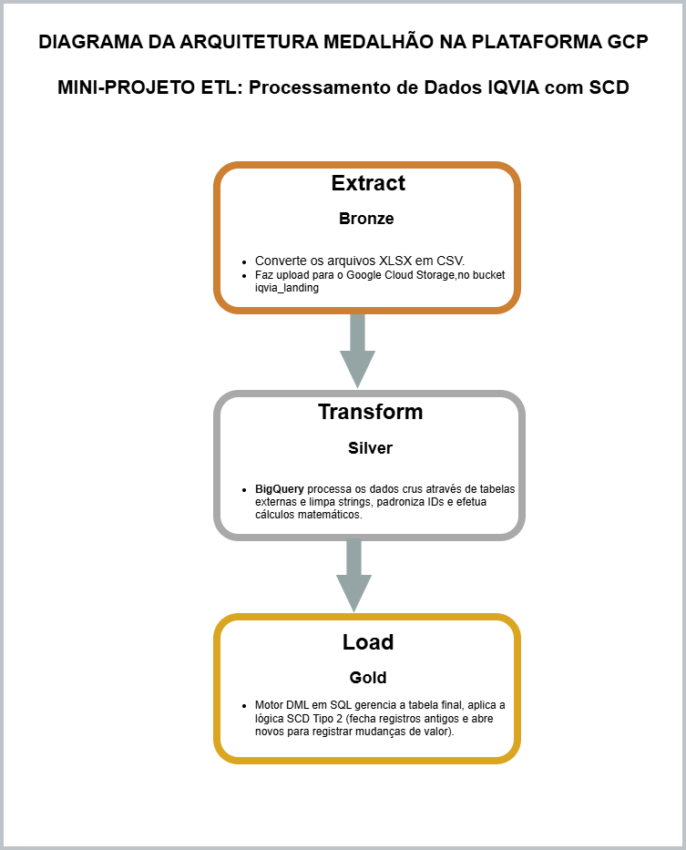
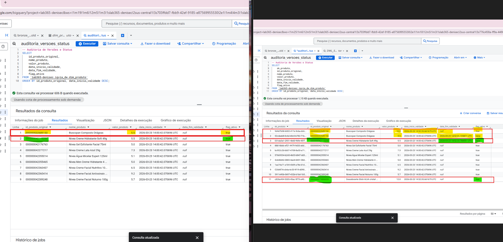

**💊 Pipeline de Dados IQVIA - Arquitetura Medallion com SCD Tipo 2**
Este projeto implementa um pipeline de dados ponta a ponta (End-to-End) para o processamento de dados farmacêuticos da IQVIA. A solução utiliza uma arquitetura ELT (Extract, Load, Transform) hospedada na Google Cloud Platform (GCP), aplicando os conceitos de Medallion Architecture (Bronze, Silver e Gold) e gestão de histórico via Slowly Changing Dimension (SCD) Tipo 2.

**📊 Arquitetura do Projeto**
O fluxo de dados foi desenhado para garantir a integridade dos identificadores e a rastreabilidade das alterações de preço e catálogo.

**Camadas de Dados:**
**Bronze (Raw/External):** Dados originais em Excel convertidos para CSV via Python, preservando zeros à esquerda e caracteres especiais.

**Silver (Staging/Cleansing):** Limpeza e padronização realizada diretamente no BigQuery (SQL), com tratamento de strings (TRIM, LPAD) e conversão de tipos.

**Gold (Data Warehouse):** Tabela final com a lógica de SCD Tipo 2, permitindo consultar o histórico de preços através de datas de validade e flags de status.



**🛠️ Tecnologias e Ferramentas**
**Linguagem:** Python 3.13 (Extração e Ingestão)

**Processamento:** SQL (BigQuery DML/DDL)

**Cloud:** Google Cloud Storage (Bucket) e BigQuery

**Diagramação:** Draw.io / VS Code Integration

**🛠️ Pré-requisitos e Instalação**

Para reproduzir este ambiente localmente, recomenda-se o uso de um ambiente virtual (venv).

**1. Instalação das dependências**

Com o Python instalado, execute no terminal:

pip install -r requirements.txt

**2. Configuração da Nuvem (GCP)**
Este projeto exige uma Service Account do Google Cloud com permissões de:

Storage Admin (para o bucket iqvia_landing)

BigQuery Admin (para criação de tabelas e execução de DML)

Certifique-se de configurar a variável de ambiente:
export GOOGLE_APPLICATION_CREDENTIALS="caminho/para/sua/chave.json"

**🚀 Como o Projeto Funciona**

**1. Extração e Ingestão (/scripts)**
O script 01_extracao.py resolve um problema crítico: a perda de zeros à esquerda pelo Excel. Ele força a leitura das colunas EAN e Cod Prod Catarinense como texto antes de gerar os CSVs. O script 02_carregamento_gcs.py envia os arquivos para o Bucket na GCP.

**2. Motor de Transformação (/sql)**
O arquivo 02_DML_SCD2_Motor.sql é o "cérebro" do pipeline. Ele executa:Padronização: EAN fixo em 15 dígitos e Código Catarinense em 13 dígitos.Enriquecimento: Mapeamento de nomes de produtos e cálculo de preços (Fórmula: $Volume / 10 + 5$).Histórico (SCD2): Se um preço muda, a linha antiga é "fechada" (flag_ativo = false) e uma nova é aberta.

**3. Auditoria e Qualidade**
Foram desenvolvidas queries de comparação para garantir que o dado na camada Gold reflete fielmente o que foi ingerido na Bronze, porém de forma limpa e tipada.

**Evidência SCD Tipo 2.**




### 📂 Estrutura do Repositório

```text
PROJETO-IQVIA-SCD/
├── data/
│   ├── processed/       # CSVs padronizados prontos para ingestão
│   └── raw/             # Planilhas .xlsx originais (dados brutos)
├── docs/
│   ├── diagrama/        # Arquivos de modelagem visual da arquitetura (Draw.io e PNG)
│   └── evidencias/      # Prints comprovando o funcionamento do histórico (SCD Tipo 2)
├── sql/
│   ├── 01_DDL.sql       # Scripts de criação das tabelas (Bronze, Silver e Gold)
│   ├── 02_DML_SCD2_Motor.sql # Lógica central do pipeline e gestão de histórico SCD2
│   ├── 03_DML_Compara_Bronze_x_Gold.sql # Validação de integridade entre camadas
│   └── 04_DML_Auditoria_Gold.sql # Query final para auditoria de preços e status
├── .gitignore           # Regras de exclusão de arquivos para o repositório
├── 01_extracao.py       # Script Python para conversão de Excel para CSV preservando tipagem
├── 02_carregamento_gcs.py # Script Python para upload automático no Google Cloud Storage
├── README.md            # Documentação principal do projeto
└── requirements.txt     # Lista de dependências e bibliotecas Python utilizadas


🏁 **Conclusão**
Este projeto demonstra a viabilidade de construir um Data Warehouse moderno utilizando ferramentas nativas de nuvem, focando na qualidade do dado e na preservação histórica, requisitos fundamentais para análises de mercado precisas no setor de saúde.

Para fins de escala em ambiente de produção com volumes de Terabytes, as tabelas Gold seriam otimizadas com: 


Particionamento por Tempo: Na coluna data_inicio_validade para otimizar queries históricas.

Clusterização por EAN: Para acelerar as operações de MERGE e busca de produtos específicos.